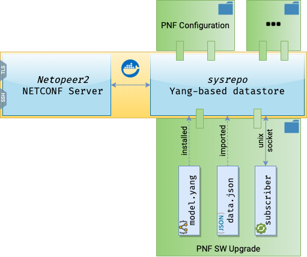

# NETCONF Plug-and-Play Simulator

[![GitHub Tag][gh-tag-badge]]()
[![Docker Automated Build][dockerhub-badge]][dockerhub]

## Overview

This project builds a modular engine that allows the creation of NETCONF-enabled devices simulators,
either physical (PNF) and virtual (VNF).

Basically it's a docker container running Sysrepo and Netopeer2 servers enhanced with a plugger script that, at
start-time, performs the following actions:

1. Configures TLS and SSH secure accesses to the Netopeer2 server;
2. Installs multiple YANG models into sysrepo datastore;
3. Launches the corresponding subscriber applications.

The picture below unveils the architecture of this solution.

A YANG module contains the following files:

| Filename | Purpose
| -------- | -------
|`model.yang` | The YANG model specified according to [RFC-6020][yang-rfc]. Alternatively, you can use your model's name as a basename for this file. Example: `mynetconf.yang`.
|`data.json` or `data.xml` | An optional data file used to initialize your model.
|`subscriber.py` | The Python 3 application that implements the behavioral aspects of the YANG model.
|`requirements.txt` | [Optional] Additional Python packages specified in the [Requirements File Format][py-requirements].

## Application

The `subscriber` is free to implement any wanted passive or active behaviour:

**Passive Behaviour**: The subscriber will receive an event for each modification externally applied to the YANG model.

**Active Behaviour**: At any point in time the subscriber can proactively change its own YANG model.

## Runtime Configuration

### Customizing TLS and SSH accesses

The distributed docker image comes with a sample configuration for TLS and SSH, that can be found at
`/config/tls` and `/home/netconf/.ssh` directories respectively. The user can replace one or both configurations
by mounting a custom directory under the respective TLS or SSH mounting point.

### Python Virtual Environment Support

Python programs usually use additional packages not included in the standard Python distribution,
like the `requests` package, for example.
We support this scenario by creating isolated Python environments for each custom-provided module whenever
a `requirements.txt` file is present in the module directory.

## Example Module

The directory `examples/mynetconf` contains an example YANG model and its subscriber along with a
Docker Compose configuration file to launch a basic simulator.

[dockerhub]:                  https://hub.docker.com/r/blueonap/netconf-pnp-simulator/
[dockerhub-badge]:            https://img.shields.io/docker/cloud/automated/blueonap/netconf-pnp-simulator
[gh-tag-badge]:               https://img.shields.io/github/v/tag/blue-onap/netconf-pnp-simulator?label=Release
[py-requirements]:            https://pip.pypa.io/en/stable/reference/pip_install/#requirements-file-format
[yang-rfc]:                   https://tools.ietf.org/html/rfc6020
